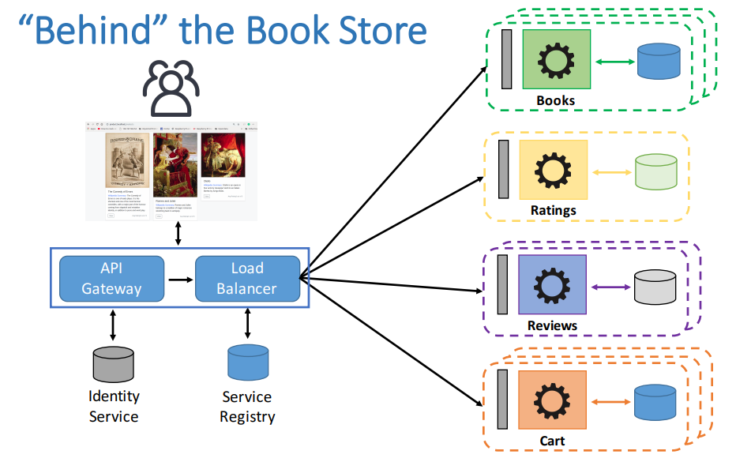

# "Bookstore" Microservice Tutorial

## Description
The purpose of this repository is to provide all the necessary source code that accompanies the 
CloudCom 2018 Tutorial Session entitled *[Designing Scalable and Secure Microservices by Embracing DevOps-as-a-Service Offerngs.](https://cyprusconferences.org/cloudcom2018/tutorials/)*

The main focus of the tutorial is to present practical challenges and benefits of adopting the microservice architecture paradigm though the *Bookstore App*.
The *Bookstore App* has been developed having the basic microservice principles in mind:
* Technology Heterogeneity
* Resilience
* Scalability
* Organizational Alignment
* Composability
* Service Discovery
* Configurability
* Ease of Deployment
* Monitoring, Logging
* Loose Coupling
* Replaceability
* Continuous Integration, Continuous Deployment

## Architecture

The Bookstore consists of the following distinct services.

* The **Books** service is responsible for handling product information regarding books such as title, author, description etc.

* The **Ratings** service is responsible for handling operations regarding a star rating system for products 

* The **Reviews** service is responsible for handling user based reviews
 
* The **Cart** service is responsible for handling operations regarding items to be purchased 
 
* The **Front-End** service is the user interface of the Bookstore App

* The **API Gateway** service is the central service of the deployment. It is responsible to authenticate requests, knows (with the assistance of the Load Balancer/Reverse Proxy) how is the underlying deployment, routes the request to the services and performs aggregations on data from various services.

In addition to the main services there are 2 additional infrastructure services that 

* The **Service Registry** service acts as a service catalog. Whenever a new service is added to the deployment, it automatically registers to the Consul Service Registry.
 
* The **Load Balancer/Reverse Proxy** service is responsible to route requests to the microservices deployed. It uses the Service Registry service to acquire knowledge of the deployed containers (what is their IP and what kind of services there are). It can be also configured to perform weighted routing which is useful for Canary Deployments, A/B Testing etc. 
  

## Key Technologies
### Spring Boot
[Spring Boot](https://spring.io/projects/spring-boot) is a java framework for building production-ready applications quickly and provides non-functional features such as:
* Embedded servers to deploy within JVM containers
* Application components are configured externally and automatically upon instantiation and runtime.
* Inherently distributed with tools for service discovery, security, API gateways, circuit breaking, message-passing, database integration.
* Open-source ecosystem with tons of smaller frameworks created (major contributors include Netflix, AWS, Spotify).

Spring Boot is based on [Spring Framework](https://spring.io/).

### Docker
### Consul
### Traefik
### JWT

## Prerequisites
* Docker
* JAVA 8
* Maven
* Docker Compose

## How to run

* Clone this project
* cd into the project folder
* run build-run-all.sh --> CAUTION! For now this script deletes all images and containers.
* wait 4-5 minutes all services will be up and running --> need to improve on this time. 

|Service | URL|
|--------|----|
| Product| http://localhost:38082/products|
| Reviews| http://localhost:28082/reviews|
| Rating | http://localhost:18082/ratings|

---

